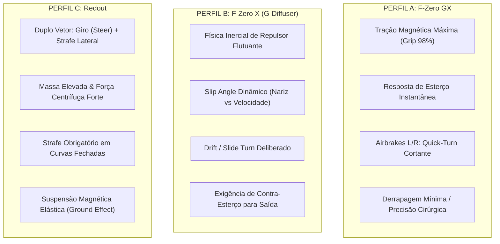

# Especificação Técnica — Protótipo 01: Pilotagem, Física de Repulsor e Câmera Dinâmica

> **Data de Atualização:** 2026-10-10
>
> **Arquivo do Protótipo:** [`prototypes/01_steering_profiles.html`](file:///c:/Users/zerke/OneDrive/%C3%81rea%20de%20Trabalho/G%20Minus/prototypes/01_steering_profiles.html)
>
> **Status:** **APROVADO para implementação funcional**, com o **Perfil C — Inercial / Drift** e o export entregue em 10/10/2026 como baseline.
>
> **Limite da aprovação:** física e dinâmica propostas pelo laboratório. Visual, VFX, áudio e pistas não foram aprovados por esta decisão.
>
> **Registro da decisão:** [`docs/decisions/2026-10-10-prototype-01-physics-approval.md`](../decisions/2026-10-10-prototype-01-physics-approval.md).
> **Referência GDD:** Itens [10] (Sensação F-Zero GX), [21] (3 Perfis de Direção), [22] (Instabilidade em Alta Velocidade), [23] (Auto-estabilização ao Soltar), [24] (Mecânica de Drift e Inércia), [25] (Freios), [26] (Freios Aerodinâmicos / Airbrakes Independentes), [27] (Perda de Velocidade por Erro), [29] (Superfícies Inclinadas), [91–95] (Câmera Dinâmica e Sensação de Velocidade), [101–102] (Gate de Prototipação, Telemetria e JSON).

---

## 1. Visão Geral e Filosofia dos Três Perfis

O objetivo deste laboratório é apresentar três abordagens de pilotagem radicalmente distintas e consagradas nos jogos de corrida antigravitacional, permitindo que o jogador/designer teste, compare e calibre os parâmetros em tempo real antes de aprovar uma física definitiva para o **G-MINUS**.

O laboratório permanece útil para comparação, mas a decisão vigente escolhe o Perfil C calibrado pelo usuário. As tabelas históricas abaixo descrevem a intenção original dos três perfis; quando houver divergência numérica, prevalecem o export aprovado e `src/game/PhysicsCalibration.ts`.



---

## 2. Detalhamento dos Três Perfis de Direção

### 2.1. Perfil A — F-Zero GX (Magnetic Grip & Snappy Quick-Turn)
* **Inspiração:** *F-Zero GX* (Nintendo GameCube / SEGA Amusement Vision).
* **Conceito:** Tração magnética absoluta nos trilhos repulsores. O veículo não desliza lateralmente de forma passiva; as mudanças de direção são agressivas, precisas e instantâneas.
* **Mecânica de Curva & Airbrakes:**
  * Esterço linear sem rampa de atraso perceptual ($\text{Progressivity} = 1.0$).
  * Aderência lateral máxima ($\mu_{\text{grip}} = 98\%$).
  * **Quick-Turn com Airbrakes (<kbd>Z</kbd>/<kbd>C</kbd>):** Acionar o freio aerodinâmico para o mesmo lado da curva corta o raio de giro instantaneamente sem perda de velocidade ou perda de aderência.
  * **Auto-Estabilização:** Ao soltar os direcionais, a nave recentraliza imediatamente com alta rigidez de amortecimento.
* **Comportamento da Câmera:** Câmera de perseguição firme, com rastreamento angular rápido e leve inclinação de roll.

---

### 2.2. Perfil B — F-Zero X (Inertial Slide & Counter-Steer Drift)
* **Inspiração:** *F-Zero X* (Nintendo 64) e o projeto de descompilação de referência [`G-Diffuser`](https://github.com/Zorkats/G-Diffuser).
* **Conceito:** A nave flutua sobre uma almofada de energia com alta inércia lateral e baixo atrito de repulsor. O vetor de momento linear tem peso dominante.
* **Mecânica de Curva, Drift & Contra-Esterço:**
  * Ao esterçar em alta velocidade, o nariz da nave aponta rapidamente na direção (<kbd>Yaw</kbd>), mas a massa continua deslizando na direção tangencial anterior, abrindo um ângulo de escorregamento (**Slip Angle** $\beta$).
  * **Mecânica de Slide / Drift:**
    * Fazer curva em alta velocidade e soltar brevemente o acelerador ou acionar o freio induz o estado de **Slide Turn / Drift**, gerando faíscas nas pontas das asas.
    * Durante o drift, o ângulo de guinada aumenta para o ápice da curva, enquanto a velocidade linear perde tração lateral ($\mu_{\text{grip}}$ reduz para 40%).
    * **Contra-Esterço Obrigatório:** Para sair da curva na trajetória ideal sem colidir com a barreira externa, o piloto **deve virar o volante no sentido oposto ao da curva** (contra-esterço), forçando o vetor de velocidade a se realinhar com a frente da nave.
* **Comportamento da Câmera:** Atraso inercial angular pronunciado; a câmera se abre lateralmente durante o drift para exibir o ângulo de ataque da nave em relação à pista.

---

### 2.3. Perfil C — Redout (Dual-Vector / Strafe Hovercraft & Ground Effect)
* **Inspiração:** *Redout* (34BigThings).
* **Conceito:** Física de hovercraft de **Duplo Vetor**. O controle da nave é desacoplado entre **Rotação de Nariz (Steer)** e **Propulsão Lateral Aerodinâmica (Strafe)**, com forte atração gravitacional/magnética ("Ground Effect").
* **Mecânica de Curva & Strafe Duplo:**
  * O esterço do volante (<kbd>←</kbd>/<kbd>→</kbd>) apenas gira a orientação frontal da nave. Devido à alta massa e aceleração centrífuga, virar apenas o volante não segura a linha e faz a nave bater na parede externa.
  * **Strafe Lateral (<kbd>Z</kbd>/<kbd>C</kbd>):** O piloto precisa acionar ativamente os jatos de strafe lateral em conjunto com o volante para vencer a força centrífuga e puxar a nave para a linha interna da curva.
  * **Fórmula Vetorial:** $\vec{v}_{\text{total}} = \vec{v}_{\text{longitudinal}} + \vec{v}_{\text{strafe}} + \vec{v}_{\text{centrífuga}}$.
  * **Efeito Solo (Ground Effect):** Suspensão magnética pesada com amortecimento elástico vertical que absorve oscilações da pista.
* **Comportamento da Câmera:** Câmera cinematográfica com suspensão inercial elástica (*spring-damper* com atraso translacional suave e recuo na aceleração).

---

## 3. Tabela Comparativa de Parâmetros e Defaults

| Parâmetro | Range do Slider | Perfil A (F-Zero GX) | Perfil B (F-Zero X) | Perfil C (Redout) | Descrição Física |
| :--- | :---: | :---: | :---: | :---: | :--- |
| `steerRate` | 20 a 120 | **85** | **65** | **50** | Taxa de rotação angular de guinada (*Yaw Rate*). |
| `progressivity` | 1.0 a 3.5 | **1.0** (Linear) | **1.4** (Suave) | **2.0** (Progressivo) | Expoente temporal da rampa de entrada do esterço. |
| `inertia` | 5 a 80 | **12** (Baixa) | **58** (Alta) | **44** (Pesada) | Inércia de massa e conservação de momento lateral. |
| `grip` | 30% a 100% | **98%** (Trilho) | **68%** (Solto/Drift) | **82%** (Amortecido) | Coeficiente de aderência lateral do repulsor ($\mu_{\text{grip}}$). |
| `airbrakeForce` | 20 a 200 | **95** (Quick-Turn) | **60** (Auxiliar) | **140** (Strafe Essencial) | Força dos freios aerodinâmicos / propulsores de strafe. |
| `recenter` | 1.0 a 30.0 | **22.0** (Instantâneo) | **7.0** (Flutuante) | **12.0** (Elástico) | Velocidade de auto-estabilização e alinhamento do repulsor. |
| `speedInstability` | 0.0 a 1.0 | **0.05** (Estável) | **0.35** (Solta em alta vel.) | **0.20** (Moderada) | Fator de perda de aderência ao superar a velocidade base. |
| `camStiffness` | 2.0 a 25.0 | **18.0** (Firme) | **8.0** (Lag de Drift) | **12.0** (Mola Elástica) | Rigidez da mola da câmera de perseguição. |

---

## 4. Tabela Completa de Comandos e Controles

| Comando | Teclas Alternativas | Ação Física no Laboratório |
| :--- | :--- | :--- |
| **Acelerar** | <kbd>X</kbd> ou <kbd>W</kbd> / <kbd>↑</kbd> | Aplica propulsão longitudinal vetorial nos motores traseiros. |
| **Frear / Drift** | <kbd>ESPAÇO</kbd> ou <kbd>S</kbd> / <kbd>↓</kbd> | Reduz velocidade longitudinal; quando combinado com esterço em alta velocidade, inicia Drift no Perfil B. |
| **Esterço Esquerda / Direita** | <kbd>←</kbd> / <kbd>→</kbd> ou <kbd>A</kbd> / <kbd>D</kbd> | Gira a orientação de guinada (<kbd>Yaw</kbd>) e aplica torque lateral. |
| **Airbrake / Strafe Esquerda** | <kbd>Z</kbd> ou <kbd>Q</kbd> | Ativa freio aerodinâmico esquerdo (Quick-Turn no GX) ou Strafe Lateral esquerdo (Redout). Double-tap: Side-Attack. |
| **Airbrake / Strafe Direita** | <kbd>C</kbd> ou <kbd>E</kbd> | Ativa freio aerodinâmico direito (Quick-Turn no GX) ou Strafe Lateral direito (Redout). Double-tap: Side-Attack. |
| **Spin Attack 360°** | <kbd>Z</kbd> + <kbd>C</kbd> simultâneo ou <kbd>SHIFT</kbd> | Rotação giroscópica de 360° para repelir adversários ao redor. |
| **Super Boost** | <kbd>A</kbd> | Consome 15% de energia de escudo para aceleração extrema temporária. |
| **Câmera** | <kbd>V</kbd> | Alterna entre Perseguição Dinâmica, Cockpit e Inspeção Orbital 360°. |
| **Reset / Posição** | <kbd>R</kbd> | Reposiciona a nave na pista com reset completo de forças e inputs. |
| **Pausa** | <kbd>P</kbd> | Congela a simulação física sem perda de estado. |

---

## 5. Ambientes de Teste do Laboratório

1. **Circuito 3D Neo-Tokyo:** Circuito completo com retas de velocidade extrema, curvas fechadas de alta elevação, chicanes e declives acentuados.
2. **Reta de Slalom com Cones:** Reta de 2.600 metros equipada com cones de tráfego para testar tempo de resposta, contra-esterço e ziguezague rápido em alta velocidade.
3. **Pista Elevada em Espiral:** Fita elevada de raio constante em subida contínua para calibrar sustentação de drift e forças centrífugas prolongadas.

---

## 6. Formato de Serialização e Exportação JSON

O laboratório permite a cópia e colagem de configurações completas em JSON estruturado com validação atômica de tipos e limites numéricos:

```json
{
  "profile": "A",
  "name": "F-Zero GX Setup",
  "steerRate": 85,
  "progressivity": 1.0,
  "inertia": 12,
  "grip": 98,
  "airbrakeForce": 95,
  "recenter": 22.0,
  "speedInstability": 0.05,
  "camStiffness": 18.0
}
```
